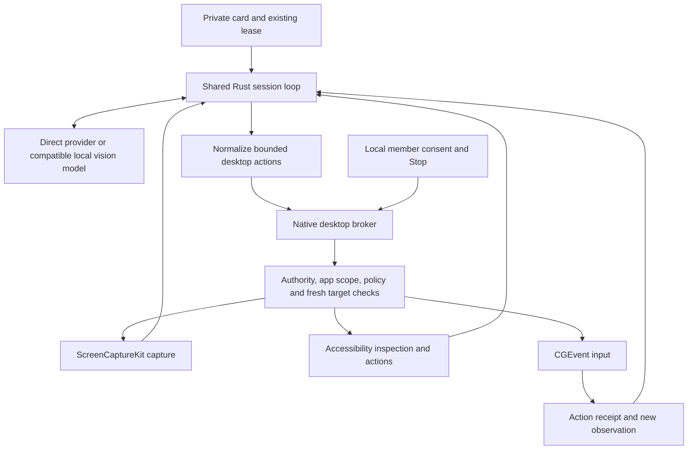

# Hive Private Fleet computer use — macOS implementation proposal

2026-09-14 · Sif your friendly Codex Agent · **Design only; not implemented**

For Claude's review against ADR-029 and ADR-024. This proposes a native desktop executor inside the
existing private card/session lifecycle. It does not enable computer use, change macOS permissions,
modify production code, or replace the approved local-folder vault work.

## 1. Recommendation and boundaries

Use the member's logged-in macOS desktop, as Jack decided. Run a narrowly scoped native broker that
owns capture and input. The cloud/local model proposes actions; the broker independently checks
session authority, app/window scope and current policy before performing each action. Start with
one selected window on one selected display and one controlling session per logged-in desktop.

Keep all of Jack's per-item guardrail controls in the design, including individually relaxing the
formerly hard-blocked categories. Do not describe the result as a sandbox, guaranteed prevention of
financial mistakes, or reliable detection of every destructive click. Application-specific meaning
cannot always be recovered from pixels and Accessibility metadata. Unknown actions require review
under the default policy; an explicitly relaxed policy accepts the corresponding additional risk.

Three corrections to ADR-029 should be reviewed before implementation:

1. **Terminal click-only is not a safe execution boundary.** Clicking Run, a task, a link or a shell
   history item can execute code. Recommend terminal/IDE view-only by default; command execution
   becomes an explicit separate grant. This changes the ADR's initial default and needs approval.
2. **A local Stop surface cannot wait for a later release.** A channel is useful for progress but
   cannot reliably interrupt a real desktop during a network stall. A persistent local indicator,
   Pause/Stop and keyboard escape are first-release requirements, even without a full session UI.
3. **An app grant is not a file/domain sandbox.** Finder, browsers and IDEs expose other resources.
   Native GUI control cannot guarantee a workspace-path or domain allowlist. Scope reliable browser
   operations through an appropriate browser tool later; never infer domain enforcement from the
   address bar or a window title.

Apple's Accessibility interface provides element inspection/action APIs; ScreenCaptureKit offers
window-scoped capture. These are mechanisms, not the app-level policy described here.
[AXUIElement](https://developer.apple.com/documentation/applicationservices/axuielement),
[window capture filter](https://developer.apple.com/documentation/screencapturekit/sccontentfilter/init(desktopindependentwindow:)).

## 2. What exists, and what must change

Source inspected in `OH Cloud-src`:

| Existing location | Reuse | Required change |
|---|---|---|
| `crates/ohhive-core/src/worker.rs`, `run_code_card` / `tick` | Claim, card result, stop signal and activity lifecycle | Pass lease deadline/session authority into execution; add explicit desktop profile dispatch |
| `crates/ohhive-core/src/coder.rs`, `BrainMessage`, `run_session` | Provider-independent turn/tool structure | Text-only message content must gain versioned image blocks; extract a tool executor interface from the hardcoded coding dispatcher |
| `coder.rs`, `CloudBrain` and `worker.rs` cloud selection | Provider configuration concepts | Existing cloud brain routes through Hub/Edge Function; introduce an explicit direct-provider desktop adapter instead of silently forwarding screenshots through that route |
| `crates/ohhive-core/src/local_hub/mod.rs` | Authenticated local ownership, leases, activity | Local desktop authorization checks, target binding and authority freshness; retain no community fallback |
| `crates/ohhive-ffi/src/lib.rs`, `HiveNode` and callbacks | Native/Rust lifetime bridge | Async desktop command/result bridge, image buffers and cancellation; current callbacks are not an input broker |
| `apps/desktop-swift/Package.swift` | Existing native application | Current target is macOS 27 on Apple Silicon; do not claim older-Mac support without testing |

Important implementation finding: `tick` receives `lease_expires_at` but does not currently pass it
into the coder loop. `run_forever` heartbeats outside the long-running card call. LocalHub can renew
leases, but GUI actions cannot assume renewal happens while a model call is in flight. Add authority
checks and a renewal task where supported; otherwise stop before the existing deadline. Reuse the
lease protocol; do not add a second scheduling system.

Proposed card encoding: retain private `modality="code"` initially, with a versioned
`required_capabilities.agent_profile="desktop_v1"`, explicit `target_node_id`, brain/model and
requested app scopes. Update both claim filters and worker validation. An older worker must never
claim a desktop-profile card and treat it as ordinary coding. Add a positive advertised desktop
capability plus fail-closed unknown-profile parsing, with mixed-version tests before rollout.
Community claim logic rejects this profile regardless of requested capabilities.

Requested scopes on a card are requests, not grants. The executing Mac must obtain current member
consent. A fully local hub's verified owner/pairing context supplies identity where a Supabase
`member_id` is absent; never invent a cloud lookup merely to authorize a local session.

## 3. Architecture and trust boundary

Recommended native deployment: a signed, non-root user-session XPC service bundled with Hive,
with a serialized action queue. Validate the connecting client's audit token/code-signing identity;
do not expose a localhost HTTP input server or accept arbitrary fleet-node requests. Prototype
actual TCC attribution for the packaged service before fixing bundle identifiers: the process that
captures/posts input must have the needed permission. Never assume the UI application's grant
transfers to a helper. If helper TCC/signing proves unsuitable, use an in-process broker behind the
same interface and explicitly document the reduced fault isolation.

Rust owns model calls, budgets and shared policy evaluation. The native broker owns current grants,
OS state and the final actuation check; bind the Rust policy engine into the broker or duplicate only
mechanical checks with shared conformance vectors. A Rust-side `approved=true` is not sufficient.
UniFFI carries structured requests/responses asynchronously; the Swift bridge forwards them over
XPC. No actor waits on a blocking FFI call on the main thread. Bound queues and buffers; control
messages such as Stop take priority over screenshots.

A helper prevents accidental alternate entry points, not malicious code running as the same OS
user. The OS grants broad Accessibility access. Compromised native code or other authorized
software remains outside this broker's protection; never market this as isolation from the owner’s
other processes.

### Tool profile and bypass prevention

A desktop session starts with desktop actions only. Do not inherit `run_command`, AppleScript,
JavaScript execution, arbitrary file writes, MCP, connectors, shell launch URLs or external-agent
control tools from the coding tool list. All enabled effectful tools must obey equivalent policy
or be explicitly labeled a broader permission that weakens the desktop restrictions. Requesting a
coding tool later requires a new explicit scope decision, not a model tool-discovery shortcut.

External agents can propose desktop actions through the same broker in a later phase; do not give
them Accessibility grants or unrestricted helper credentials. Concurrent coding sessions that can
spawn automation tools also defeat a claim of enforced desktop isolation. The first release excludes
such concurrent Hive sessions on the same OS desktop; unrelated user applications remain outside
Hive's control.

## 4. Session authority, consent and lifecycle

Proposed `DesktopSessionSpec`: version, owner/project/card/node IDs, lease session, deadline,
brain/model, requested applications, selected display/window, action/turn/time/cost limits and
capture destination. The broker generates an unpredictable session handle; it is never model text.

Each approved app grant binds bundle/signing identity, running-process identity (PID plus launch
instance), allowed windows, access tier and policy revision. PID or bundle name alone is insufficient.
App restart, lock/unlock, logout, sleep/wake, lease loss, node revocation and broker restart invalidate
active grants. Recovery requires a fresh local confirmation and observation.

States: `awaiting_local_consent → observing → acting → observing`, with `awaiting_confirmation`,
`paused`, `stopped`, `failed`, and `needs_review` transitions. Waiting retains the existing card lease
only while valid. Never automatically release and replay a partly executed desktop task elsewhere.
Stop marks an interrupted task for review and records what is known to have happened.

For a remote private hub, refresh lease/node authority on a short bounded interval and stop on failed
refresh; proposed upper bound five seconds, adjustable after testing. The broker also checks a
monotonic local deadline before each action. This bounds revocation delay; it does not promise
instant revocation during partitions. A disconnected coordinator cannot initiate or renew control.
The local user can always revoke control without contacting the coordinator/provider.

Consent UI belongs to trusted local chrome on the executing Mac, with that session's input queue
suspended. It shows task, apps, provider, screenshot disclosure and requested exceptions. The model
cannot call consent endpoints or click its way through grant dialogs. Security authentication and
consent provenance are protocol requirements, not another action-category toggle: allowing an agent
to accept an OAuth screen does not make it the owner of Hive's control plane.

## 5. Per-action contract and policy gate

Every normalized request includes session, sequence number, provider tool-call ID, observation ID,
policy revision, target process/window, typed action parameters and expiration. Bind any one-time
approval to a digest of this exact action and target. Policy changes or target changes invalidate it.

Before **every** read/capture/action, the broker:

1. Checks authentic session, valid lease/fresh authority, current policy, stop state and budgets.
2. Checks app/window grant and that this action type is implemented and in scope.
3. Re-resolves foreground process, focused element, target window and geometry. Rejects stale
   observations, changed targets, out-of-bounds/nonfinite coordinates and offscreen points.
4. Evaluates action policy: `allow`, `confirm`, `deny` or `unknown`. Classification may use AX role,
   action name and context; model descriptions are evidence, never authority. Unknown follows the
   member's explicit policy, defaulting to confirmation rather than assuming benign intent.
5. Obtains any bound local approval, then repeats target/authority checks immediately before execution.
6. Journals dispatch intent, performs one bounded action, records outcome and invalidates the old
   observation when the action can change the UI. Verifies with a new observation as appropriate.

The same gate covers `AXUIElementPerformAction` and AX value setting, not only `CGEvent.post`.
There is no public raw event-posting function. Shell/AppleScript fallbacks are absent.
[Apple event posting API](https://developer.apple.com/documentation/coregraphics/cgevent/post(tap:)).

Suggested defaults (policy proposal, not a claim of semantic certainty):

| Scope/category | Default | Member exception |
|---|---|---|
| Unapproved app | No capture or input | Session-specific app approval |
| Browser | View-only after approval | Separate interaction grant |
| Terminal/IDE | Recommend view-only | Explicit execution/interaction grant; ADR amendment above |
| Ordinary approved editor | Control within selected window | Narrow to view-only if desired |
| Sending/publishing, purchases, settings changes | Confirm exact consequential action | Individually explained scoped exception |
| Payment credentials, trades/transfers, permanent deletion, CAPTCHA interaction, unattended external consent | Deny | Each independent override per ADR-029; shipping copy requires its already-recorded legal review |
| Unknown action meaning | Confirm | Separate broad-interaction exception explaining uncertainty |

Each relaxation has an independent identifier, explanation version, scope and expiry. Recommend
session-only by default, with reusable preferences shown and reconfirmed at the next session grant.
Turning one item off changes no other item. Provider restrictions and OS permissions still apply;
Hive does not promise an override makes a provider perform an otherwise unsupported action.
No financial/CAPTCHA automation recipes are needed to implement this general policy mechanism.

## 6. macOS capture, targeting and input

**Permission setup.** Offer setup only after the member requests computer use. Check Accessibility
with `AXIsProcessTrustedWithOptions`; requesting its prompt is asynchronous and is not a grant.
Preflight input posting separately. Use ScreenCaptureKit's system content picker where suitable;
verify capture permission/filter behavior on the packaged supported OS. Permission denial or
revocation produces an actionable local status, never a script that edits TCC or auto-accepts macOS
dialogs. [Accessibility trust](https://developer.apple.com/documentation/applicationservices/1459186-axisprocesstrustedwithoptions),
[input preflight](https://developer.apple.com/documentation/coregraphics/cgpreflightposteventaccess()),
[content picker](https://developer.apple.com/documentation/screencapturekit/sccontentsharingpicker).

**Capture.** Use `SCContentFilter` for an explicitly selected window and `SCScreenshotManager` for
bounded still frames; no audio. Compose that capture on a stable, otherwise blank display-sized
canvas. This retains a consistent coordinate origin while excluding unapproved windows rather than
capturing the entire desktop and hoping redaction finds everything. Pause on unexpected dialogs,
window replacement or app transition. Newly required windows need scope resolution before capture.
Do not depend on window-sharing flags alone to hide the consent UI.

**Geometry.** Each observation records display ID, global display bounds, window bounds, backing
scale, output image size, crop/letterbox transform and timestamp. Convert screenshot pixels through
that recorded transform to Quartz global coordinates; never assume pixels equal points. Reject
coordinates in blank canvas regions. Test Retina/non-Retina, negative display origins, rotation,
resizing, Spaces and offscreen windows. Display topology changes invalidate observations. Begin with
one display; do not advertise multi-display control until these tests pass.

**Accessibility.** Use AX to identify target ownership, focused controls, secure fields and available
actions; bound tree depth, count, text and timeouts. Text and descriptions are untrusted data. Secure
field values are excluded. If AX is missing, pixels can support an explicitly approved interaction,
but semantic uncertainty must remain visible; do not silently increase access.

**Input.** Translate validated clicks/scrolls/keys into bounded CGEvents. Prefer semantic AX actions
where their meaning matches the requested action. Literal typing must target the freshly validated
focused element. Avoid the shared clipboard for routine typing; a future clipboard tool needs its
own permission because clipboard history/sync can disclose data. Reject unsupported keys/actions.
Release only Hive-held keys/buttons on stop/error; breaking a long gesture into cancellable steps
must recheck authority between steps. Focus can still race after a check: CGEvent provides no atomic
"click only if this exact window remains here" contract. Human intervention should pause control,
and rapid focus changes should cause retry/confirmation rather than best-effort clicking.

Credentials default to human handoff: suspend capture/input while the member logs in, then capture
fresh after resumption. If a member later enables credential entry, propose local secret handles
with exact target/origin binding and no raw secret in model messages/logs. That needs a separate
credential-handler review; generic screen OCR cannot reliably identify every secret or origin.

## 7. Model adapter and screenshot loop

Current Anthropic documentation distinguishes `computer_toolset_20260801` from earlier
`computer_20251124` integrations. Pin a tested model/tool protocol pair rather than copying a stale
beta identifier from the ADR. The adapter must preserve toolset identity, tool-call IDs and ordered
results; stop later batch actions after a failure. Screenshot coordinates use the full screenshot
space, including after zoom. Compatibility tests must cover withheld/unknown actions and image
sizing. [Current computer-use protocol](https://platform.claude.com/docs/en/agents-and-tools/tool-use/computer-use-tool).

Hive-specific loop: obtain a permitted observation; call the chosen model; normalize its proposed
actions; gate and execute serially; return structured results and permitted images. A new policy
revision, stale frame or approval request interrupts the sequence. Do not run a whole provider batch
under one blanket approval. Preserve complete provider response blocks required for continuation;
do not force multimodal responses through `Option<String>`. Keep provider-specific encoding in the
adapter and test it with recorded synthetic protocol fixtures.

Use local Keychain-backed BYOK configuration for direct provider calls from the executor. This is
new work: existing server-held keys are not automatically available locally. Ask the member to
configure a local key through trusted UI; never export their server key silently. Existing paid
ChatGPT/Claude subscriptions are not presumed to authorize API calls; supported subscription-backed
agents can be separate adapters later, subject to documented support and the same broker gate.
A local vision model must pass the same tool/geometry tests before being selectable. Nous/local
text tool-calling capability alone does not establish desktop competence.

Cloud mode discloses that selected-window images and task text go to the chosen provider. The local
index, raw desktop, credentials and account settings do not go to Supabase as a side effect. Use
local activity for fully local projects, and only minimal authorized progress metadata for any
cloud-managed Private Fleet channel. No screenshots or typed text in channel posts by default.

## 8. Recovery, receipts and limits

Persist minimal local receipts: action ID, target identity, policy revision, dispatch time and
`not_dispatched / dispatched_unknown / observed_result`. No raw screenshots, secure values or typed
text by default. Restrict receipt files to the OS user; retention and optional diagnostic recording
need explicit controls. A dispatch-intent write must succeed before effectful execution.

Exactly-once GUI effects are impossible to guarantee across a crash. If the helper posts a click
and crashes before recording its result, recovery must show uncertain outcome and request review.
Never automatically repeat a Send/Buy/Delete action because the network response was lost. A new
model turn is not proof of a new user intent. Duplicate provider IDs in the same session return the
stored receipt or uncertain status, rather than re-executing.

Proposed pilot limits: one active session/desktop, 100 model turns, 15 minutes before explicit
extension, bounded screenshot bytes, one input action in flight, short key/gesture durations and
provider spending cap when usage data supports enforcement. These are proposed engineering
starting values, not measured performance promises. A model declaring completion produces a review
summary; verified application state determines what can honestly be reported as done.

## 9. Build sequence and acceptance gates

1. **Policy and session contracts:** mixed-version claim rejection; shared multimodal messages and
   executor interface; deterministic policy engine; fake desktop adapter. Verify ordinary coding
   behavior remains unchanged. No real input in this phase.
2. **Native read-only pilot:** signing/TCC/XPC proof, picker/window filtering, geometry and AX bounds,
   local indicator and Stop. Test with synthetic documents/accounts on a dedicated test Mac logged
   into a real desktop. No personal screen capture required for verification.
3. **Bounded input pilot:** trusted grants, final broker checks, action journal, human interruption,
   focus changes, cancellation and uncertain-outcome recovery. Use local fixture apps with visible
   buttons and reversible effects before a provider controls anything.
4. **Provider loop and fleet wiring:** direct BYOK, protocol fixtures, consent pauses, authority
   refresh and two-machine scheduling. GUI approval occurs on the executing Mac. Only after these
   pass consider broader apps and reviewed per-item relaxations.

Required adverse tests: app/PID restart, forged/replayed action, grant revocation mid-batch, broker
crash after event posting, lease expiry during model latency, hub partition, Stop while typing,
held keys, sleep/lock/user switch, popup over target, unapproved modal/dialog, stale coordinates,
malicious AX/page instructions, unsupported tools, oversized images/text, attempted shell/MCP bypass,
cloud routing failure, clipboard/secure-field leakage and missing/revoked TCC. Test screenshots sent
to the provider, not merely previews displayed locally. These are planned tests; none were run for
this proposal.

## 10. Decisions requested from Claude/Jack

Recommend accepting the terminal default correction and requiring the minimal local Stop UI now.
Recommend approving the separate desktop tool profile, direct-provider disclosure/configuration,
and no automatic replay after uncertain effects. Retain all already-decided per-item overrides;
legal review of the relevant explanation copy remains a shipping prerequisite from ADR-029, not
work performed in this design. Prototype helper TCC attribution before choosing the final process
boundary. Windows/Linux get the same contracts later, with platform-specific adapters and tests;
macOS design alone does not establish three-platform readiness.

**Claude: please review this proposal before implementation**, especially the broad-code bypass,
claim/lease changes, prompt-versus-local-consent boundary, and unavoidable semantic/focus races.
The local-folder vault's physical two-machine acceptance and desktop wiring remain separately queued.

Sif your friendly Codex Agent
