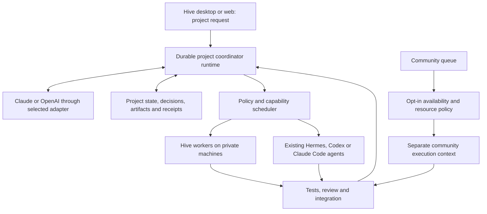

# Personal Hive: one coordinator, your computers, optional community work

September 13, 2026 · **Sif your friendly Codex Agent**

For Jack and Claude/Loki. This is a product and implementation review, with recommendations for review—not an adopted ADR or instruction to implement every item immediately.

## Recommendation

Make Hive the easiest way to give a project to a cloud coordinator, watch it distribute useful work to your own computers, and receive a verified result. When those computers have spare capacity, let their owner contribute to community projects under an explicit policy.

Hive has substantial foundations: member-owned nodes, local execution, cards and dependencies, leases, worker checkpoints, provider routing, persistent memory, and a Private Fleet activity channel. It does **not yet demonstrate the complete coordinator → multiple local workers → review → revision → finished project → community contribution loop** in the source reviewed here. The highest-value next work is joining those pieces into one dependable experience.

Keep the existing Rust core, hub, and card model. Add a durable project-coordinator runtime, precise execution policies, and agent adapters. Keep Halo pooled inference optional. Do not make users understand Honey, regional servers, model sharding, or MCP configuration before completing their first private job.

## Decisions confirmed with Jack in this review

| Question | Jack's answer |
| --- | --- |
| Provider connection | Both API keys and existing subscriptions where supported. |
| Private work arriving during community work | Let each user choose the switching behavior. |
| First polished release | macOS, Windows, and Linux equally. |
| Existing agents versus Hive's runtime | Both, through one fleet interface: connect existing agents and run Hive-managed workers. |
| Data sent to a cloud coordinator | Full project context when the user enables cloud coordination. |

Cloud-coordination consent applies to the selected provider. It does not publish the project to other Hive members or grant community jobs access to private files, memory, or credentials.

## Scope and confidence

Reviewed local source at commit `95cc705596d958e8b84608b882b3b5bc05b6f220`, including in-progress changes on September 13. The working tree is actively being edited by another agent. In particular, ADR-024, `coder.rs`, and coding-related changes were uncommitted during review. Treat file and line references as a snapshot; re-read them before implementation.

Goals reviewed: ADR-012, ADR-015, ADR-016, ADR-020, ADR-022, ADR-023, ADR-024, `docs/Good Idea Fairy.md`, and the shared Hive/Halo continuity log. Cmd Work is described as the authoritative work-item system, but no callable Cmd Work connector was available in this session. Consequently, this is not a verified inventory of the live backlog. Claude should reconcile the recommendations against current Cmd Work items, especially #177, #178, #185, and #186, before creating duplicates or declaring anything missing.

This was a source/documentation review, not a live database audit or cross-platform execution test. “Present” below means supported by inspected code; “reported shipped” means the log says so. Neither means that I personally ran it successfully.

## What exists, and what still separates it from the goal

| Area | Evidence and current assessment | Next requirement |
| --- | --- | --- |
| Personal execution | Owner-matched local-mode claims and no Honey payout for local work exist. | Separate execution eligibility, data visibility, and donation policy. |
| Private Fleet channel | Web `/fleet` reads/posts member-scoped events; Swift support is reported shipped. | Commands need to start durable runs and receive correlated results. Posting text currently calls a post RPC, not a coordinator. |
| Cloud chat/planning | `interview/index.ts` routes BYOK conversation and can create a project plan. | A persistent coordinator must monitor completion, inspect evidence, replan, and finish the project. |
| Local agent execution | Generic worker has Draft/Check/Revise, checkpoints, and declared child-card delegation. New `coder.rs` has a real tool loop. | Verify actual model tool use, cancellation, artifact delivery, and recovery. Coding currently supports only the local brain; source explicitly says real Ollama validation remains outstanding. |
| Cloud coding brain | ADR-024 describes it; `CodeBrain` is a useful extension point. Worker rejects non-local brains in the inspected branch. | Complete the cloud adapter, then distinguish a cloud worker from the fleet-wide project coordinator. They are different roles. |
| MCP | `mcp.rs` and ADR-023 support a member-configured, one-shot stdio tool call. | Add machine-aware configuration and advertised tool availability. This is an outbound tool client, not yet a Hive control server for external agents. |
| Routing | Claim SQL matches modality, selected model, ownership, internet/tools settings, and dependencies. | Add target-agent/node/workspace placement and a private-first policy. Current ordering is card priority/order/time. |
| Availability | Check-in/out and weekly scheduling code exist. | Enforce one availability policy in the actual worker loop across CLI, Swift, and Tauri. A schedule in the CLI presence loop is not proof that every executor honors it. |
| Memory | Member-level chat memory exists; events provide receipts. | Project and agent isolation, versioned decisions, retrieval, and controlled reuse of learned skills. |
| Platform parity | Shared Rust core, Tauri shell, native Swift shell. Tauri's inspected tabs remain Setup/Node/Server/Earnings/Settings/About. | The same first-job, coordinator, fleet, review, and community controls on all three desktop OSes. |
| Halo pooling | Independent experimental track with measured LAN success and follow-up results. | An opt-in capacity capability, not a prerequisite for personal-fleet orchestration. |

## The most important design gaps

### 1. Private execution currently does not establish private visibility

The original community design deliberately allowed active members to read all projects. `20260905000001_hive_schema.sql:269` creates member-read policies including projects/cards/checkpoints/artifacts. `20260905000005_member_views.sql:6` lists all projects for members. The latest repository definition of `project_board` found in `20260908030000_local_execution_mode.sql:127` returns plans, inputs, required capabilities, and outputs with a final `hive.is_member()` check rather than project-owner authorization.

This is a direct mismatch with the new private-project promise. It does not establish that the live database currently has the same definition, and it does not contradict the member isolation of the separate Private Fleet channel. Claude should verify live definitions and policies immediately, then test with two unrelated member accounts.

Introduce explicit visibility independent of `execution_mode` and license. `owner_only` is a licensing label, not an access-control mechanism. Private content must be filtered in base-table policies **and** security-definer RPCs, exports, snapshots, search, artifacts, notifications, and event payloads. Start private by default in the personal workspace. Sharing or promoting a project must be a deliberate action with a clear description of what becomes visible.

### 2. There is no private/community arbitration contract yet

The inspected `node_claim_card` definition (`20260913100000_code_modality_gate.sql:26`) lets an eligible node claim either owner-local or funded community work, ordered by ordinary priority. It does not implement “my work wins,” community-only availability windows, or a selected target node. `presence=checked_in` is too coarse to represent these choices.

Add a per-member default with per-machine overrides:

- **Private only**: never claim community jobs.
- **Help when available**: accept eligible community work only when policy permits spare capacity.
- **Dedicated community capacity**: a user can reserve selected capacity for community work.

For private work arriving during a community attempt, expose **finish current job**, **pause at a safe checkpoint**, or **stop and retry community work later**. Only offer checkpoint-and-switch when the specific runtime supports it. Otherwise display the actual behavior and expected delay. Distinguish a hardware-idle check from an empty private queue; a person using their computer should not lose responsiveness just because Hive has no private cards.

Community participation must be opt-in, reversible, and constrained by resource limits, power/battery policy, schedules, job type, and a manual pause override. Re-evaluate policy before a claim and during long-running work. Use a cooldown to avoid rapid private/community switching. Do not change a private project's execution mode merely to donate idle capacity.

### 3. A machine, model, and agent are different objects

An avatar for Odin is useful, but Odin may host several models and both Hermes and a Hive coding worker. A model responding to prompts is not by itself an agent with tools and a resumable session.

Introduce a small agent registry: owner, machine, runtime/adapter, capability set, model/provider, workspace bindings, allowed tools, availability, version, and supported lifecycle operations. Keep the UI simple: machines contain available agents; users normally choose “Best available,” with “Run on Odin” as an override.

Place jobs using an explicit workspace ID and a per-node binding, not an absolute path assumed to exist on every computer. For coding, bind the run to a repository revision and an isolated working copy. Return changes as a patch/commit plus evidence. Let one integration step combine reviewed outputs; multiple workers should not race to edit the user's primary checkout.

### 4. Resuming a chat is not recovering distributed work

Generic worker checkpoints are valuable, but the new coding path explicitly bypasses them and ignores dependency/resume data (`worker.rs:731`). `coder.rs` states that a re-claimed coding card restarts from turn one. Its four-hour lease does not solve crash recovery, deadline expiry, or duplicated file operations.

Add durable attempts, independent heartbeats/lease renewal, cancellation, child-process cleanup, and an operation journal. Resume from recorded artifacts and workspace revision, not from a conversational guess. Use attempt/fencing tokens so an old worker cannot submit after a replacement has taken over. Record idempotency keys for side effects and reject stale or duplicate completions. A resumed shell command must not silently repeat a deployment or destructive change.

Keep this separate from Halo's model-shard recovery; a successful checkpoint at an agent step does not demonstrate mid-token recovery of pooled inference.

## The experience users should have

1. **Add a computer.** Install Hive, sign in/pair, name it. Discover installed models and supported agents, run a small capability check, and offer a guided installation if needed. Show download size, disk requirements, and readiness. No pasted shell commands for the normal desktop path.
2. **Connect a coordinator.** Choose Claude or OpenAI, connect through a supported subscription runtime or API key, and see the applicable usage limit or spending budget. Enable cloud context sharing for this project.
3. **Describe the outcome.** “Build a small site for my club. Use my computers.” Hive asks only for missing outcome requirements, assigns suitable workers, and explains which machines will be used. Expose a plan when it helps the user make a decision; do not force a technical card editor.
4. **Watch and intervene.** A project view shows current work, completed artifacts, blocked decisions, and a durable receipt trail. Pause, steer, retry, or change the coordinator without losing the recorded project state.
5. **Receive a usable result.** The coordinator checks the requested outcome, shows test/review evidence, and delivers the files. “Worker returned text” must not mean “project finished.”
6. **Offer spare capacity.** A separate “Help the community when available” setting previews the schedule, resource limit, supported job types, and interruption policy. Private files and private agent memory stay out of community runs.

Use the same navigation and vocabulary across platforms: **Projects, Private Fleet, Community, Settings**. A project's workspace can contain its conversation, tasks, deliverables, and activity. Preserve Jack's “everything is recorded” requirement; optional view filters should hide visual noise without deleting events. Use normal user-facing activity receipts, not hidden model reasoning, as the audit trail.

## Architecture to complete the loop

The cloud model makes planning and review decisions; a durable service owns job state, scheduling, and retries. Do not let a long-lived browser tab or one Edge Function request own the project lifetime. Keep the current Edge Function as an entry/provider adapter where appropriate. Add a coordinator service that wakes on user messages, completed attempts, deadlines, approvals, and budget changes. Use one renewable coordinator lease per project, a durable event cursor, and bounded retries.

Give it narrow tools: inspect fleet, create/update tasks, dispatch, get artifacts, request review, pause/cancel, and record decisions. Every command must be authorized for the member/project and checked against the approved execution policy. Private Fleet posts remain records; an explicit command envelope identifies which posts request execution and prevents quoted logs or another agent's output from becoming commands accidentally.

Existing cards remain work units. Extend their contract with execution target, workspace binding, acceptance criteria, context/artifact references, budget, interruption semantics, and runtime requirements. Preserve a distinction between an attempt finishing, an output being accepted, and a project satisfying its goal. Currently downstream claims accept dependencies in `review` or `done`; make acceptance-sensitive dependencies explicit so rejected code does not silently become another worker's foundation.

Default routing should favor a single capable local worker per task, parallelizing independent tasks across machines. Invoke the cloud for planning, hard decisions, and review according to the user's policy. Measure quality and repair rate on actual workloads; do not assume every smaller model can call tools reliably. Offer explicit cloud fallback when no eligible local worker can complete a job—never a silent charge or change in data-sharing boundary.

For subscription-backed runtimes, a user-owned, online machine may need to host the authenticated adapter. For API-backed coordination, the persistent service can use a server-side provider adapter. Show “coordinator offline” distinctly from “workers offline”; preserve queued work and expose which machine must stay online. Do not advertise fully offline/private-hub independence until ADR-016's authentication, migration, and local-hub lifecycle are actually delivered.

## Learn from Hermes and Buzz without duplicating both products

**Hermes:** adopt durable delegation, explicit context packages, isolated agent sessions, and reusable task procedures. Its official delegation documentation describes independent child contexts and asynchronous completion delivery; its memory documentation separates curated memory from searchable history and warns against multiple agents sharing one profile directory. Hive should implement owner/project/agent memory scopes with versioned writes and retrieve evidence from its event store. Avoid a single shared mutable memory file for all workers. [Delegation](https://hermes-agent.nousresearch.com/docs/user-guide/features/delegation/) · [Memory](https://hermes-agent.nousresearch.com/docs/user-guide/features/memory/)

**Buzz:** retain the channel-and-receipts direction and add meaningful agent identities and scoped participation. Its repository describes humans and agents sharing channels, an event-based record, and an agent harness bridging ACP and MCP. Adopt the useful interaction and adapter patterns; replacing Hive's hub with Nostr or rebuilding a source-code hosting platform is not necessary for this milestone. README/vision claims are reference material, not features independently tested in this review. [Buzz source](https://github.com/block/buzz/blob/main/README.md)

Hive's differentiator should be demonstrably easy fleet setup, reliable project completion, and optional reuse of idle hardware for community work. “Better” should be measured against those outcomes rather than a longer feature list.

## Provider and agent integration

Use two independent interfaces: a **coordinator/provider adapter** for reasoning and an **agent-runtime adapter** for work execution. The latter should advertise start, status, events, cancel, resume, artifacts, capabilities, and authentication state. Resume is a declared capability, not a universal promise. Keep native runtime session IDs in the adapter record.

- **Hive local worker:** retain `CodeBrain` and the generic backend seam. Add model tool-use probes and context limits.
- **OpenAI/Codex:** the official App Server exposes API-key and managed ChatGPT login, session/event APIs, and rate-limit reporting. It is a concrete candidate for integrating a user's Codex account. Use the documented local runtime flow; keep account credentials out of the shared Hive database. This does not make a ChatGPT subscription a general API key. [Official App Server documentation](https://learn.chatgpt.com/docs/app-server)
- **Claude:** implement API-key support and evaluate the official Agent SDK/Claude Code runtime path. Anthropic's current help article says Agent SDK, `claude -p`, and third-party app usage still draw from subscription limits; its announced credit change was paused. Reconfirm the supported product/authentication flow and distribution requirements before promising a Hive-branded sign-in, and treat provider policy changes as an adapter capability update. [Current Claude plan guidance](https://support.claude.com/en/articles/15036540-use-the-claude-agent-sdk-with-your-claude-plan) · [Agent SDK](https://code.claude.com/docs/en/agent-sdk/overview)
- **Hermes and other existing agents:** integrate supported runtime protocols/APIs through adapters. Discover their actual versions and features; do not assume a Hermes model means the Hermes Agent harness is installed. Keep each agent's state/profile isolated.
- **External control of Hive:** add a separate, owner-scoped Hive control API and optionally an MCP server so existing agents can submit jobs and retrieve receipts. ADR-023's outbound MCP client does not provide this direction. Never expose raw community-database credentials or unrestricted fleet administration to a coordinator.

## Safety and community participation are part of usability

Retain the explicitly accepted private-fleet full-access mode from ADR-024. However, the current `sandboxed_tools` label also gates an unsandboxed coding process; the UI must explain actual access. Offer protected workspaces and narrowly scoped tools as an approachable default, while making full access an explicit supported choice. Ownership removes the stranger-compute issue; it does not prevent accidental deletion, malicious repository instructions, or a compromised agent.

Community runs need separate process/workspace/secret/memory contexts. Do not enroll a user's fully privileged personal agent unchanged into arbitrary community projects. Share its execution capacity using a restricted community profile; initially accept only job types with proven isolation. Keep arbitrary community shell/coding jobs gated until that boundary and artifact verification exist. Prefer subprocess groups with cancellation/timeout cleanup appropriate to each OS.

The continuity log's honey-ledger audit finding is a community expansion gate: verify current SQL, enforce server-side payout limits/validated accounting and idempotent completion, and test fabricated usage. Merely capping payout at the remaining project balance does not prevent a false completion from consuming it. Also verify revocation and private data isolation before expanding users. This report does not claim to have reproduced the live audit.

Keep private API spend, local machine time, and community Honey separate in the UI. Donating local compute must not silently spend a user's cloud subscription or API balance. An independent explicit opt-in would be required for that resource.

## Prioritized delivery sequence and acceptance gates

| Phase | Work | Demonstration required before moving on |
| --- | --- | --- |
| 0: Reconcile and protect | Reconcile current code/ADRs/Cmd Work, verify private visibility, review payout finding, clarify execution permissions. | Member B cannot access member A's private project through table reads, board/list RPCs, exports, snapshots, artifacts, search, or event feeds. Community jobs cannot reach private workspaces or credentials. |
| 1: First useful private job | Finish local coding runtime and cloud adapter; deterministic workspace/node placement; onboard and probe workers on all three OSes. | An ordinary user pairs each supported OS and completes a small local task without terminal setup, receiving a real artifact and evidence. Unsupported hardware/models are explained before dispatch. |
| 2: Coordinator completes a project | Durable coordinator, scoped tools, task dependencies, review/revision, budgets, event wakeups, and one initial existing-agent adapter. | One cloud coordinator assigns work to at least two private machines, observes results, requests a correction, integrates outputs, and finishes against acceptance criteria. Closing the UI does not end the project. |
| 3: Private/community switching | Shared availability policy, explicit opt-in, resource constraints, selected interruption behavior, separate community profile. | While community work runs, a private job arrives and every supported switching policy behaves as labeled; no output is lost silently, no duplicate payment occurs, and no private context crosses into community work. |
| 4: Recover and polish | Runtime recovery, adapter parity, memory retrieval/skills, notifications, clean installs and upgrades on all OSes. | Kill a worker/coordinator, interrupt networking, exhaust a provider limit, and restart a machine. The UI shows the truth and the run resumes or fails clearly without duplicating side effects. |

Add regression checks alongside the slice that needs them rather than postponing all reliability work until phase 4. Checkpoint-based switching in phase 3 is gated by recovery support for that runtime. Ship subscriptions and API keys through whichever documented adapters are actually available; never pretend provider capabilities are identical.

Proposed usability targets, to measure rather than claim today: first job within ten minutes on an already model-equipped machine; no terminal commands in the normal desktop path; no duplicate accepted completions under retry; explicit handling for all rate-limit/offline states; comparable task success across Mac/Windows/Linux. Track time to first useful artifact, completion rate, human interventions, repair attempts, private-job wait time during donation, cloud spend, and energy/resource impact where measurable.

## Changes to the goals list I recommend Claude propose

Promote **private visibility**, **durable cloud coordinator**, **agent adapters**, **workspace-aware placement**, **community contribution policy**, **recovery**, and **three-platform user-flow parity** to the critical path. These complete Jack's stated endpoint.

Reconcile #177 against existing MCP code rather than restarting it. Review the in-flight #185 local coder before designing a second loop. Complete/reconcile #186's cloud brain and start surface, but do not confuse that with a project coordinator. Keep #178 release notes useful but secondary. Bring ADR-012's milestone table up to date with ADR-022/023/024 and Jack's equal-platform decision; preserve its historical decisions while recording amendments explicitly.

Recommend postponing additional media breadth, decorative agent features, additional messaging bridges beyond one working path, and broader community rollout until the private loop is reliable. Do not silently cancel the existing all-modality or scale goals: propose sequencing changes for Jack's review. Retain Halo and local-hub portability as independent tracks with explicit integration gates.

The September 11 Test 05 review supports this sequencing: local-solo Qwen3-32B completed the tested chained writing task in 244.9 seconds versus 591.6 seconds for warm pooled 70B, with better instruction adherence in that evaluation. That is one task/model comparison, not a universal ranking. It supports testing task-specialized workers before spending all available machines on one pooled model. Also reconcile the Run A log's arithmetic before reusing its claimed savings: its listed totals of 950.7 and 588.0 seconds differ by 362.7 seconds, while that entry describes roughly 452 seconds of avoided restart time. Those can represent different components, but they should not be presented as the same total-time reduction.

## Claude/Loki handoff

Please review this document against the current working tree, live database, and Cmd Work backlog. In particular:

1. Verify the private-visibility issue against live SQL and record the two-account result; review it alongside the existing security audit.
2. Finish/reconcile in-flight ADR-023/024 work without overwriting another session's edits. Record which paths have actually run successfully.
3. Propose amendments covering the durable coordinator, agent/workspace registry, and private/community arbitration. Preserve Jack's five confirmed answers above.
4. Convert accepted recommendations into small, dependency-ordered Cmd Work items with acceptance tests. Mark existing completed items instead of creating duplicates.
5. Choose a proof project that spans two or more owned machines and yields a verifiable artifact, then exercise community handoff with no private-data exposure.
6. Report disagreements and tradeoffs to Jack. This document is a request for your review, not an instruction to accept its architecture unquestioningly.

No application code, database, running agents, or deployments were changed by Sif during this assessment.
