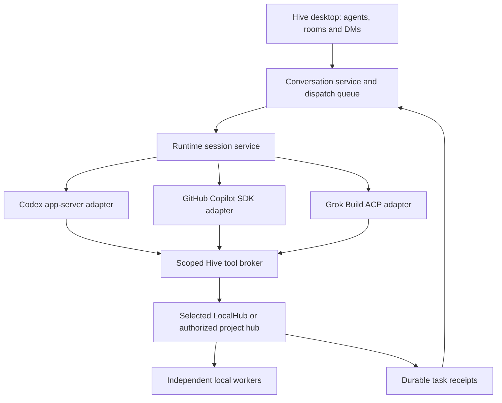

# Hive: three subscription coordinators — implementation plan

2026-09-15 · Sif your friendly Codex Agent · Implementation specification, not a release claim.

## Scope and starting point

Jack selected this order: **ChatGPT → GitHub Copilot → Grok. Stop at these three.** Gemini, Mistral, Kimi, MiniMax, Z.AI and Alibaba are outside this implementation queue. This supersedes the broader sequencing recommendation in the earlier provider investigation. Existing local-model and explicitly selected BYOK features remain available.

Read [ADR-034](../ADR/ADR-034-three-subscription-coordinators.md), [ADR-033](../ADR/ADR-033-chatgpt-subscription-coordinator.md) and the [detailed Codex handoff](SIF-CHATGPT-SUBSCRIPTION-INTEGRATION-HANDOFF-2026-09-15.md). The latter remains the detailed Codex contract; this document adds the other adapters and common boundaries. [ADR-035](../ADR/ADR-035-bots-chat-and-agent-collaboration.md) supplies agent/conversation identity.

Observed code: `crates/ohhive-core/src/subscription/` contains framing, a supervisor, reducer and fake server. Its `protocol.rs` explicitly says types are hand-authored, not generated. The log reports Stage 1 committed, but full Stage 1 acceptance still requires pinned schema generation and compiler/test verification. No process, OAuth, durable journal, broker or UI implementation is claimed by that scaffold. Do not confuse its presence with a working ChatGPT connection.

## 1. Common architecture

All three are agent runtimes, not raw-model substitutions inside `CodeBrain::next_turn`. A desktop coordinator is an ADR-031 external session, not a fabricated ADR-032 leased parent. Credentials stay on the coordinating host. Six local models remain six independent workers. Only the selected context/results travel to the selected provider after cloud coordination is enabled.

Introduce a provider-neutral domain layer without rewriting Codex transport first:

| Proposed seam | Responsibility |
|---|---|
| `subscription/service.rs`, `types.rs` | Account handles, session lifecycle, capabilities and typed domain events |
| `subscription/adapters/codex.rs` | Wrap current Codex modules; migrate names only when needed |
| `subscription/adapters/copilot.rs` | Official Rust SDK client and provider-specific permission/session mapping |
| `subscription/adapters/grok.rs` | Official Grok process plus pinned ACP client library |
| `subscription/journal.rs`, `broker.rs`, `policy.rs` | Recovery, execution authorization, exact placement, deduplication |
| `crates/ohhive-ffi/src/subscription.rs` | Shared methods/callbacks for Swift; matching Tauri commands |
| `crates/hive/src/main.rs` | Proposed `coordinator-tools` MCP entry point from the Codex handoff |

Prefer the documented official Rust Copilot SDK to fit the core. A compatibility spike must compile required APIs against a pinned version. If the Rust surface cannot meet a gate, use the official TypeScript SDK in a pinned sidecar behind the same domain interface; do not reverse-engineer the CLI protocol. This fallback needs a recorded packaging decision, not a second agent implementation.

Domain contract (proposed names, not provider wire methods):

- `connect(provider, login_attempt_id)`, `cancel_login`, `disconnect(account_handle)`.
- `status`, `models`, `limits`: nullable observations with timestamp and source; unknown never means unlimited.
- `create_session(binding)`, `resume_session`, `send_turn(operation_id, context)`, `interrupt_turn`, `answer_request`.
- Events: account/auth changes, text updates, tool lifecycle, approval/input request, linked task, result, limits, pause, terminal turn, protocol failure. Every event carries account/session/turn IDs and runtime generation.

A binding fixes owner, agent, conversation/thread, provider account, host, workspace, allowed projects/tools and policy revision. Changing provider or widening context creates a new binding/session with an explicit handoff summary. Never replay an entire private DM into another provider implicitly. One writer lease per runtime session; fence every mutating broker request by lease generation.

Durable records: session binding; turn intent (`operation_id`, input hash, status); provider IDs; task submissions keyed by stable Hive request ID; pending approvals; watch cursors; terminal receipts. Commit intent before sending. On a lost acknowledgement, reconcile remote/session/task state first. If it cannot be reconciled, display `delivery_unknown` and require a deliberate continuation; never blindly replay an action. Transport request IDs are not execution deduplication keys.

## 2. ChatGPT — implement first

Use the complete six-stage Codex handoff. Required next work:

1. Finish Stage 1 acceptance: select a runtime, generate and hash its schemas, replace/validate hand-authored shapes, run the feature tests. The prior 0.149.0 check is evidence, not the shipping pin.
2. Add direct process spawning with isolated child configuration and verified credential namespace; stdout reader, bounded writer/stderr, process-tree cleanup and generation fencing. Run `app-server` over stdio.
3. Implement managed login, account/model/limit state and logout on all desktop shells. Show provider-owned browser/device challenge; do not extract OAuth tokens.
4. Add the scoped MCP bridge and durable journal before allowing submissions. Recheck ownership and exact target at the backend; do not trust tool text.
5. Implement turns, approvals, cancellation and restart/reconciliation; then test a two-worker and six-worker project with a correction and evidence-backed completion.

Documented flow uses initialize/initialized, account login/read, thread creation/resume, turn start/interrupt and terminal events. Adapt exact fields to the pinned schema. Native Codex framing omits the `jsonrpc` field; do not share its encoder with ACP. Use managed login and configured MCP, not internal external-token injection or assumed dynamic tool support. [App-server documentation](https://learn.chatgpt.com/docs/app-server)

## 3. GitHub Copilot — implement second

### Account setup

For a developer pilot, official CLI-owned login is supported. For the shipped Hive button, prefer a Hive GitHub App with device flow enabled and explicit user tokens passed to the SDK. This avoids accidentally selecting unrelated `gh` or CLI credentials. GitHub documents both subscribed-user and app OAuth access. Use explicit-token mode with logged-in-user fallback disabled; strip inherited credential overrides from the child. No BYOK or organization-billed server mode. [SDK authentication](https://docs.github.com/en/copilot/how-tos/copilot-sdk/auth/authenticate)

Register the application before testing consumer onboarding. The desktop uses the public client ID and GitHub device authorization endpoints, displays the returned code/verification page, and polls respecting interval, expiry, cancellation and `slow_down`. No client secret goes into a desktop binary. Fetch the user identity after success and bind it to the attempt and Hive owner. Store tokens in OS secure storage. [Device flow](https://docs.github.com/en/apps/creating-github-apps/authenticating-with-a-github-app/generating-a-user-access-token-for-a-github-app)

Hive owns token lifecycle in app-token mode. If the chosen registration's refresh operation requires a confidential client secret, the desktop must reauthorize on expiry for v1; do not embed that secret or invent an invisible exchange service. A later server-assisted refresh design would require an explicit credential-custody decision. Copilot login does not authorize Git repository access: request repository permissions separately when that workflow is implemented. [OAuth integration](https://docs.github.com/en/copilot/how-tos/copilot-sdk/setup/github-oauth)

### Sessions and tools

Pin SDK and CLI versions together. Resolve an absolute official CLI executable and isolate session storage. Set explicit account token, no stored-user fallback and an honest Hive client name. Create one SDK client per connected identity; avoid a shared multi-user service for v1.

For each chat binding: persist a Hive-generated session ID; create session with selected available model, controlled working directory, streaming, permission/input handlers and the Hive MCP server. Register observers before submitting a turn. Map SDK messages/tool events to domain events; use terminal/idle state plus reconciliation to finish, not the last text fragment. [SDK compatibility](https://docs.github.com/en/copilot/how-tos/copilot-sdk/troubleshooting/compatibility)

Use a session-scoped stdio MCP bridge. Alternatively a supported custom-tool callback may call the same broker, but it must not implement a separate authorization path. Explicitly constrain built-in shell/file tools; do not copy examples that approve everything. Deny unsupported permission requests with a visible reason. [MCP setup](https://docs.github.com/en/copilot/how-tos/copilot-sdk/features/mcp)

Resume requires reinstalling runtime handlers/tool configuration and reconstructing broker state. Copilot does not supply application-level session locking and in-memory tool state does not survive restart; Hive's journal and lease are mandatory. [Persistence](https://docs.github.com/en/copilot/how-tos/copilot-sdk/features/session-persistence)

Gate: eligible account with no API keys → login → DM response → one Hive task → reconnect without duplication → logout, plus expired auth, revoked app, denied organization policy and quota exhaustion. Keep precise method signatures in an SDK conformance fixture rather than presenting uncompiled snippets as an implementation.

## 4. Grok — implement third

Grok Build is the runtime; Grok Bot is a UI reference, not the backend to embed. Official materials describe subscription use and orchestration via ACP. [Build overview](https://docs.x.ai/build/overview), [announcement](https://x.ai/news/grok-build-cli)

1. Pin a supported official binary, record hash/license/platform and verify its local help/handshake. The official source documents `grok agent stdio`; use that command only after the pinned-binary check. Do not assume `gemini --acp` is a universal launch convention.
2. Create a private Hive-managed Grok home. Run official browser/device login there; keep token refresh/logout runtime-owned. Never copy auth into the xAI API adapter. Verify storage behavior: Grok may use owner-protected files, so do not advertise keychain storage without evidence. Exclude its auth directory from vault indexing, exports and machine sync.
3. Spawn ACP with bounded independent I/O. Negotiate protocol/capabilities using the library's typed version. Advertise only client filesystem/terminal features actually implemented; coordinator mode should expose the minimum surface.
4. Authenticate through discovered supported methods or the separately completed official login; never hardcode an OAuth client ID from another app. Create `session/new` with isolated cwd and the scoped MCP server; persist returned session ID. Submit `session/prompt`, reduce `session/update`, service permission requests and map the final stop reason.
5. On interrupt, send supported cancellation and distinguish acknowledged cancellation from an offline runtime. On restart use negotiated `session/load` support with the same cwd/MCP policy. Otherwise start a clearly labeled recovery session containing bounded authorized receipts, without resubmitting completed tasks.

Source for launch/lifecycle: [official Grok source README](https://github.com/xai-org/grok-build/blob/main/crates/codegen/xai-grok-shell/README.md). Protocol contract: [ACP session setup](https://agentclientprotocol.com/protocol/v1/session-setup). Implement with the ACP library, not illustrative single-line-reader examples: responses and notifications can interleave. Version-pin method types, permission options and MCP configuration.

Reject API keys and unintended proxy/provider overrides in effective configuration. Authentication precedence differs across Grok materials, so do not rely on ordering to guarantee billing. Test the selected binary with deliberately contaminated test configuration. Preserve managed organization restrictions. [Enterprise authentication](https://docs.x.ai/build/enterprise)

Gate: subscription login and named account are proven; no API credential selected; MCP discovery and durable task return; restart/cancel/permission-denial behavior; quota pause. Model/limit extensions are optional negotiated capabilities; absence produces “not available,” not fabricated quota values.

## 5. Shared execution and product behavior

Expose only three new subscription tiles, in Jack's order. Each tile shows connected account, coordinating machine, availability and a disconnect action. Users choose one coordinator per project/room; connecting three services does not start three competing planners. Other agents may participate only when explicitly configured.

The broker exposes project/fleet discovery and bounded submit/status/result/wait tools from the Codex handoff. A submitted request binds workspace, target/placement, role, acceptance criteria, capability scope and idempotency key. Result-ready is not accepted/done. Use task events to wake coordinators; do not spend cloud calls polling unchanged worker state.

Existing account overage policies can cause charges even without API fallback. Hive must not enable them, buy credits, or claim universal free usage. If strict included-quota enforcement cannot be verified, display that limitation before enabling unattended execution; disable strict-mode automation rather than claiming an unenforceable ceiling. No silent provider switch on quota failure.

Native Swift on macOS and Tauri on Windows/Linux share service semantics. Browser/mobile surfaces initially display connected-host availability; they cannot spawn these processes. App quit suspends cloud coordination in v1 while submitted cards remain durable. Remote access and an always-on host service are separate delivery gates.

## 6. Build order, verification and handoff

| Stage | Deliverable | Completion evidence |
|---|---|---|
| P0 | Finish Codex scaffold acceptance | Generated schema fixtures; feature tests compile/pass |
| P1 | ChatGPT end to end | Account, tools, two-worker correction, restart and six-worker pilot |
| P2 | Copilot conformance + account registration | SDK/CLI version pair, device login, explicit identity isolation |
| P3 | Copilot end to end | Same lifecycle/task/failure matrix as P1 |
| P4 | Grok conformance + account | Pinned ACP handshake, official login, effective config proof |
| P5 | Grok end to end | Same lifecycle/task/failure matrix as P1 |
| P6 | Release all desktop platforms | Packaged runtimes, bindings/builds, secure storage, rollback, accessibility |

For every provider inject crash-after-submit, duplicate event, stale approval, revoked project, wrong target, unavailable machine, malformed frame and slow UI. Confirm bounded memory/queues and no credential exposure. Test remote policy enforcement, not just tool descriptions. Real provider tests use a disposable private project and eligible user account; preserve sanitized transcripts/version evidence under `docs/subscription-integration/`.

Claude should review before implementation. No dependencies installed, provider app registered, login performed, migration applied or cloud turn run in this documentation task. Current scaffold tests were not rerun: this is a plan, with its unverified prerequisites explicitly listed.

Sif your friendly Codex Agent
