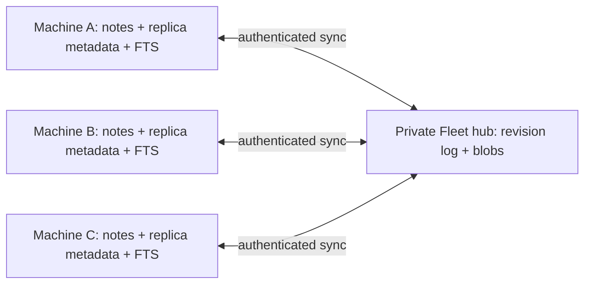

# ADR-028 — offline, multi-machine vault synchronization

**Sif your friendly Codex Agent — 2026-09-14. Design proposal, not implementation.**

Jack chose editable copies on every Private Fleet machine, including offline editing. That replaces
the earlier central-query recommendation. Recommend **local replicas plus one trusted fleet hub
for durable exchange**, with immutable note revisions, durable device outboxes and explicit conflict
preservation. Do not use last-write-wins timestamps or copy SQLite databases between machines.

One correction to the previous ingestion sketch is essential: one publisher per source namespace
cannot model several machines editing the same note. Each device owns an **operation namespace**;
all devices in a vault share the same document identities. The hub validates, stores and distributes
operations; each replica can edit/search independently of it.

## 1. Product and availability contract

Every enrolled device keeps the vault's supported note files, a local metadata database and a
rebuildable local search index. Editing and search continue when the hub or every other device is
offline. Exchange resumes when the hub is reachable. Two devices cannot exchange new changes while
both lack access to that hub; neither loses local editing capability. Peer-to-peer exchange and
automatic hub failover are separate future work, not required for this proposed offline contract.

V1 proposals for a bounded release:

- UTF-8 Markdown notes; full-vault replicas, not selective synchronization. Initial safety cap:
  4 MiB per note, explicit configurable vault-size quota. These limits need product review.
- Human editing in existing editors, not simultaneous character-by-character collaboration.
- Rename/move, delete, offline creation, conflict review and restore are included.
- Attachments, arbitrary binaries, permissions/extended attributes and `.obsidian` settings are
  not included in this first implementation estimate. Preserve unsupported local files and label
  them “not synced”; do not imply an image-linked note makes its images available elsewhere.
- Read/search agent tools only. Syncing human edits does not authorize agents to curate/write notes.

If “complete Obsidian vault” includes attachments at launch, add that explicitly before approval;
it changes storage, resumable-transfer, quota and verification work. It is not silently included.

## 2. Architecture and the role of LocalHub

Reuse LocalHub's host lifecycle direction, pairing identities and private transport. Add a distinct
vault protocol/service; do not add personal file synchronization to the community job `Hub` contract.
The hub's vault metadata/log may live in its versioned LocalHub SQLite database, while immutable
content blobs live in a private sibling directory. Every other machine necessarily has its own
**replica database** for durable offline operations. That is new state, not duplicated hub databases.
FTS is built locally from the replica's materialized state and can be rebuilt; it is never synced.

Split shared Rust components into `VaultStore` (local revisions/search), `VaultScanner`,
`VaultSyncClient`, `VaultSyncService`, and a journaled filesystem materializer. Swift and Tauri share
those components. Their shells supply folder selection, persistent access, lifecycle/background
execution and conflict/status UI. The current UniFFI LocalHub gap still has to be built.

Do not let scans, parsing, network transfer or blob I/O hold LocalHub's existing shared transaction
mutex. Metadata commits are bounded; uploads stream outside that lock. Validate the effect on
existing card/heartbeat latency before release.

## 3. Stable identity, import and filesystem mapping

A vault has a random `vault_id`. Each logical note has a random `document_id`, assigned on first
import/create and carried by the sync protocol forever. Paths and content hashes are attributes,
not identity: two notes with identical content remain two notes, and a renamed note stays itself.
Each replica stores `document_id ↔ local relative path`, last materialized revision/hash and a
filesystem-application journal. Keep this metadata in application storage, not user frontmatter;
we should not rewrite every note merely to add an ID.

Initial enrollment starts from an empty chosen destination or an explicit import reconciliation
screen. The first source assigns IDs; new replicas receive the manifest/IDs before materializing
files. Never assign fresh IDs independently to supposedly identical pre-existing vault copies and
then automatically collapse them by filename/hash. Show matching candidates for owner confirmation,
or import as separate documents with collision-safe names. A copied folder without replica metadata
is an import, not automatically a new authenticated device or an identity-preserving replica.

Observed renames can preserve IDs using a paired rename event or platform file identity, but neither
is universally reliable. After a missed event/restart, ambiguous delete+create is preserved as a
new document plus a deletion candidate, with a “possible rename” suggestion. Do not guess identity
from equal content. Normal editor atomic replacement at an established path is treated as an edit
of that path's mapped note; document this behavior and test it across editors.

Portable path rules are protocol-versioned: normalized separators and Unicode comparison, no
absolute paths or `..`, no platform device/reserved names, no symlinks, and case-insensitive collision
detection across supported systems. Preserve the user's display spelling. Distinct files that
collide under those rules are retained with deterministic ID-based conflict names, never overwritten.
Case-only renames need a temporary intermediate filesystem name where required. V1 does not rewrite
wikilinks automatically after a move; expose broken/ambiguous-link status as a separate concern.

## 4. Immutable revisions and causal ordering

Each device receives a stable replica ID at enrollment and persists a monotonic local counter.
An operation ID is `(replica_id, counter)`. A new installation gets a new replica ID, even if copied
from a backup; it must not reuse another active replica's counter/key. Credentials stay in the
platform secret store, outside synced files.

A proposed operation contains:

- protocol version, vault ID, operation ID and document ID;
- parent revision IDs (the exact state/heads the edit was based on);
- resulting relative path and either a content blob hash/byte length or a tombstone;
- a deterministic revision digest over a versioned canonical encoding of those fields.

Content blobs use SHA-256 over exact bytes. Preserve content bytes/line endings; avoid a normalizer
creating repeated “edits.” Wall-clock times are display metadata only. The hub assigns a monotonically
increasing **delivery cursor**, but arrival order never selects whose edit survives.

Parents must belong to this document/vault. Upload local dependency chains before children; reject
unknown/invalid parents with a recoverable “send dependencies/resnapshot” response. Operations are
immutable: a repeated ID with the same digest returns the same acknowledgement; the same ID with a
different digest is a protocol error, not an update.

The set of live heads is the maximal revisions under ancestry. A descendant replaces the heads it
descends from; concurrent branches remain. Every replica receiving the same revision set computes
the same heads, regardless of delivery order. A manual resolution is another revision naming all
heads the user reviewed; an unseen concurrent edit stays as an unresolved head after that resolution.
This avoids clock-based loss and does not require a collaborative text CRDT in v1.

## 5. Conflict rules users can understand

| Situation | Proposed behavior |
|---|---|
| One edit based on the current head | Apply normally. |
| Same note edited offline on A and B | Retain both heads and both contents; show a conflict, never choose by timestamp. |
| Edit and rename concurrently | Retain both full variants. Do not silently combine them in v1. |
| Two renames concurrently | Retain both desired paths as variants until the user resolves the name. |
| Separate notes created at the same path | Preserve separate document IDs; materialize collision-safe names and request resolution. |
| Delete versus unchanged replica | Apply tombstone; move local file into recoverable app trash. |
| Delete versus offline edit | Preserve edit and tombstone as a conflict. Do not silently resurrect or erase the edited bytes. |
| Resolution races another offline edit | The newly arriving branch remains a conflict; a prior resolution cannot erase a head it never saw. |

For unresolved branches, materialize deterministic names such as `Plan (conflict <revision-id>).md`
for **each live variant** and mark the document conflicted. Reserve the last resolved canonical path
as a clearly labeled last-resolved view when it exists; do not display it as the current settled
answer. For initial-create/path collisions without a shared resolved version, show only variant
files until resolved. The materializer records variant identities so they are not re-imported as
unrelated notes on the next scan. Editing a known variant creates a child of that variant; it does
not automatically resolve the other heads.

A resolution UI offers compare, keep either version, keep both as separate notes, or save merged
text. Keeping both creates a new document ID for the extra note. Automatic diff3 merging could be
added later, but it is excluded from the baseline estimate; no silent “AI merge” of curated notes.
Search returns conflicts with variant/revision labels and excludes duplicate last-resolved views
from normal results. Citations identify vault/document/revision rather than just the changing path.

## 6. Deletions, retention and long-offline devices

A deletion is an explicit revision/tombstone, not an absent manifest entry. Only a successful complete
scan of an accessible source can infer disappearance; permission failures, missing mounts, watcher
overflow and incomplete scans mark state uncertain. Large inferred deletion batches require a
user-visible review before distribution. That operational safeguard is separate from normal
single-note edits and from the ADR-027 decision to create skills automatically.

Keep tombstone identity and revision ancestry indefinitely in v1, with a quota/maintenance policy,
so a months-offline device cannot resurrect a deleted note by presenting an old snapshot. Proposed
recoverable content retention is at least 30 days **and** acknowledgement by all currently enrolled
replicas. An offline device can extend retention indefinitely; show the owner its storage cost and
allow explicit retirement. Do not expire membership silently to free space.

Retiring/revoking a replica stops future sync access but cannot erase copies it already possesses.
On re-enrollment it gets a new identity, downloads a current snapshot, and offers unsent local work
as an explicit recovery import. It must not replay an abandoned replica's operations automatically.
Actual deletion from backups follows a separately disclosed backup-retention policy.

## 7. Interrupted transfer, retry and durable application

1. A stable local file observation produces a blob plus operation in a durable local outbox. Write
   and flush the blob before committing an outbox reference to it; retain local pending changes
   across app termination. Temporary editor writes are debounced/retried, not read as final content.
2. Upload missing content addressed by hash. With the proposed 4 MiB Markdown cap, retry the whole
   bounded blob in v1; partial uploads use a temporary name and never become visible. Verify declared
   size/hash before atomically publishing it. Larger attachment chunking is separate scope.
3. Publish operations only after their blobs are durable. The hub commits operation/digest,
   document-head updates and delivery cursor in one transaction, then acknowledges. Dropped replies
   lead to an idempotent retry. Orphan uploaded blobs are swept only after a safety interval.
4. Download cursor pages with byte/count limits and a stable upper cursor. Save received metadata,
   blobs and local apply intents durably before acknowledging the applied cursor. Snapshot bootstrap
   records a high-water cursor, then streams later operations; it must not miss edits during download.
5. Materialize using temporary files, verified hashes, flush and atomic replacement, plus a journal
   for multi-path rename/delete steps. Filesystem and SQLite are not one transaction: restart replays
   the journal idempotently, then reconciles actual disk state before advancing the applied cursor.

Before replacing any existing file, compare its bytes to the last materialized revision. If a user
edited it since, harvest that edit into the local outbox first and recompute heads including pending
local revisions. Remote updates must never overwrite unrecorded local work. Record remote apply
origin/hash to avoid watcher feedback loops, but still inspect subsequent genuine human edits.
Disk-full, missing permissions or unavailable roots leave a pending/error state, not a false
acknowledgement of application. Bound reconnect backoff, queues, disk usage and error visibility.

Periodic manifest reconciliation exchanges IDs/revision hashes/tombstones at a recorded cursor,
not raw SQLite files. It repairs missed delivery or a rebuilt index; it does not treat a stale
replica's manifest as authoritative or infer deletes from absent remote data. Do not compact the
hub log until every active replica is covered by a retained, verifiable snapshot and cursor policy.

## 8. Identity and privacy boundaries

Owner grants are per vault: read/replicate, publish human edits, administer membership. A general
worker pairing code alone should not grant the whole personal library. Local agent tools remain
read-only even though the desktop replica has permission to synchronize the user's file edits.
Separate the sync credential from agent-executable command environments where practical.

Authenticate every upload, fetch, manifest, cursor and blob request against vault membership;
knowing a hash is not authorization. Restrict external paths and quotas before allocating storage.
Use authenticated encrypted transport with a pinned/trusted hub identity, including on LAN; current
LocalHub numeric-LAN plaintext support should not become the vault's automatic default. The hub is
a trusted member-owned component and may read vault content; this proposal is not an end-to-end
opaque relay. A tunnel terminating TLS adds a separate intermediary trust choice. No notes or
credentials go through community Supabase, and no automatic fallback exists.

Offline local reads remain possible after remote revocation because files are already present;
state that limitation honestly. Cloud agents receive retrieved content only under the user's
applicable explicit cloud-context setting. Notes remain untrusted source material, not permission
to execute embedded instructions. Recovery backups include note content, replica metadata and hub
ancestry/cursors; a restore must not reuse stale device counters or roll back accepted hub history
silently. Planned hub replacement requires owner-controlled identity/epoch migration, with all
replicas reconciling unsent operations; automatic failover is excluded from v1.

## 9. Acceptance tests and rollout gates

Before any real vault is enrolled, a deterministic model-test harness should permute delivery order,
duplicate/drop replies and restart actors at every acknowledgement boundary. Required invariants:
all acknowledged revisions recover after restart; all branches remain available; equivalent operation
sets converge; no expired/revoked member fetches new data; no local unpublished bytes are overwritten.

Then test on actual macOS, Windows and Linux: offline edit/edit, edit/delete, rename/edit, path/case
collisions, atomic-save editors, unknown-parent/reordered operations, counter reuse, duplicate IDs
with different payloads, truncated uploads, disk-full, missing/remounted roots, partial scans,
crash during rename/apply, long-offline device after tombstone retention, restored backups and
revocation. Exercise two clients plus hub concurrently, not just HTTP mocks. Validate no egress to
community endpoints. Use synthetic vaults before a backed-up real library.

Proposed benchmark corpus: 10,000 notes / 100 MiB plus a 100,000-note stress tier; test sustained
saves while card/heartbeat traffic runs. Record ingest time, peak memory/disk, query latency,
heartbeat impact and reconnect convergence. These are test inputs, not measured capacity claims.
The UI must distinguish local saved, waiting to sync, syncing, synced, conflict and error states.
“Synced” means acknowledged according to the selected scope (hub versus all online replicas), not
merely that a local write succeeded.

## 10. Complexity and schedule estimate

This is a small distributed storage system plus desktop filesystem integration. Planning estimate
for an engineer experienced with Rust, SQLite and synchronization, using the current codebase:

| Work package | Engineer-weeks |
|---|---:|
| Protocol/state model, versioning, model-test harness and failure invariants | 2–3 |
| VaultStore/revisions/blobs, FTS, migration and stable-ID import | 2–3 |
| Watcher/reconciliation and crash-safe filesystem materialization | 2–3 |
| Hub/client exchange, durable outbox/cursors, membership and recovery | 2–3 |
| UniFFI/lifecycle integration and Swift sync/conflict UI | 2–3 |
| Three-platform validation, backup/restore and hardening | 2–5 |
| **Total to a defensible v1** | **12–20 engineer-weeks** |

These are judgment-based ranges, not measured velocity or a fixed bid. A two-engineer team might
reach that gate in roughly 8–12 elapsed weeks, but protocol integration and hardware testing are
not fully parallel. Coding agents can help implementation/test generation; they do not remove the
need to observe crash recovery and real editor/filesystem behavior. Availability of working Windows
and Linux test shells is a schedule dependency. Full Tauri product UI, attachments, automatic text
merge, selective sync, peer-to-peer exchange and automatic hub failover add scope beyond this range.

A useful early milestone is local VaultStore/search and the executable protocol model in roughly
2–3 weeks, with synthetic data only. Do not call that a syncing alpha. Stop at reviewable gates:
model invariants → two-replica synthetic convergence → cross-platform crash tests → backed-up
real-vault pilot. Production-readiness is a test outcome, not a date inferred from code completion.

## 11. Decisions to carry back into ADR-028

Accept hub-mediated exchange with offline replicas (as distinct from peer-to-peer), explicit
conflict preservation, stable IDs without frontmatter injection, and a Markdown-only initial scope
or explicitly expand attachments. Decide the retention/quota defaults and how much conflict UI
belongs in the first supported shell. These are proposed choices for Jack/Claude to review, not
new approvals assumed by this document.

The ADR's final build-order paragraph still says remote sources are only needed if central-folder
access proves insufficient. That is now stale: multi-writer replicas are the decided requirement.
Replace it with the staged sequence above. VaultStore/search can begin independently, but model
identity as `document_id + revision` now; do not make path the immutable key or assume one copy of
the index fleet-wide. This proposal does not start the sync implementation or change existing notes.
